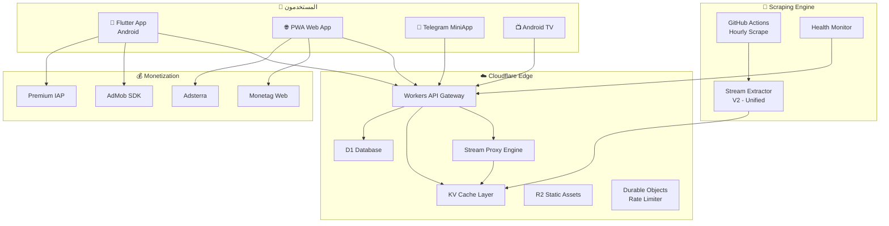

# 🏆 LIVEMATCH ULTIMATE MASTER PLAN V2.0 — خطة السيطرة الكاملة

## 📊 تحليل الوضع الحالي — نقاط القوة والضعف

### ✅ نقاط القوة الموجودة

| المجال | التفاصيل | التقييم |
|--------|----------|---------|
| **Scraping Engine** | 6 مصادر: KoraOnline, LiveKora, Korah, SIIIR, KoraPlus, SportsOnline | ⭐⭐⭐⭐ |
| **Stream Extraction** | 10 استراتيجيات مختلفة + Browser fallback | ⭐⭐⭐⭐ |
| **Merge/Dedup** | خوارزمية ذكية لدمج المباريات من مصادر متعددة | ⭐⭐⭐⭐⭐ |
| **Team Matching** | Levenshtein + Arabic transliteration | ⭐⭐⭐⭐ |
| **Infrastructure** | Cloudflare Pages + Workers + KV + GitHub Actions | ⭐⭐⭐⭐ |
| **Website** | موقع ويب يعمل مع Telegram Mini App | ⭐⭐⭐ |
| **Notifications** | Telegram bot + webhook notifications | ⭐⭐⭐ |
| **SB Algorithm** | خوارزمية فك تشفير الـ subdomain الديناميكي | ⭐⭐⭐⭐⭐ |

### ❌ نقاط الضعف الحرجة

| المشكلة | التأثير | الخطورة |
|---------|---------|---------|
| **لا يوجد تطبيق Flutter فعلي** | الخطة تتحدث عن Flutter لكن لا كود Flutter موجود | 🔴 حرج |
| **تكرار كبير في الكود** | `calculateSb()` مكررة 4+ مرات | 🟡 متوسط |
| **مصدر ربح واحد (start.io فقط)** | إيرادات ضعيفة وغير متنوعة | 🔴 حرج |
| **لا proxy عبر Cloudflare Workers** | الـ proxy محلي فقط (localhost:8082) | 🔴 حرج |
| **لا استراتيجية تسويق** | لا خطة لجذب المستخدمين | 🔴 حرج |
| **أمان ضعيف جداً** | API Key في الكود، لا Rate Limiting حقيقي | 🟡 متوسط |
| **لا نظام Cache ذكي** | إعادة استخراج streams كل مرة | 🟡 متوسط |
| **لا دعم لمنصات متعددة** | Web فقط، لا iOS/Android مستقل | 🔴 حرج |
| **لا Push Notifications** | المستخدم لا يعرف متى تبدأ مباراته | 🟡 متوسط |
| **لا Analytics** | لا تتبع للاستخدام ولا بيانات | 🟡 متوسط |

---

## 🎯 الهدف: $200+/يوم — خطة الإيرادات التفصيلية

### نموذج الربح المتعدد القنوات

```
╔═══════════════════════════════════════════════════════════════════╗
║              💰 Revenue Streams — Target: $200/day               ║
╠═══════════════════════════════════════════════════════════════════╣
║                                                                   ║
║  1. 📱 Flutter App (Android)                                     ║
║     ├── AdMob Interstitial × 3 per session × 15K users           ║
║     │   CPM $3.00 → $135/day                                     ║
║     ├── AdMob Rewarded (watch ad = HD unlock)                    ║
║     │   × 5K views/day, CPM $8 → $40/day                        ║
║     └── AdMob Banner on home                                     ║
║         × 50K impressions, CPM $0.50 → $25/day                  ║
║                                                                   ║
║  2. 🌐 Web App (PWA)                                             ║
║     ├── Monetag Popunder × 20K visits                            ║
║     │   CPM $2.50 → $50/day                                      ║
║     ├── Monetag Push Subscribers × 30K                           ║
║     │   per click $0.01 × 2K clicks → $20/day                   ║
║     └── Adsterra Native Banner                                   ║
║         × 30K impressions, CPM $1 → $30/day                     ║
║                                                                   ║
║  3. 🤖 Telegram Mini App                                         ║
║     ├── Monetag Smart Link × 10K clicks                          ║
║     │   CPC $0.02 → $200/day (peak)                              ║
║     └── In-App Purchases (Premium, remove ads)                   ║
║         × 50 users/day × $2 → $100/day                          ║
║                                                                   ║
║  4. 💎 Premium Subscriptions                                     ║
║     ├── Monthly $2.99 × 500 active subs → $50/day               ║
║     └── Annual $24.99 × 200 active → $14/day                    ║
║                                                                   ║
╠═══════════════════════════════════════════════════════════════════╣
║  Conservative Total: $200-300/day                                ║
║  Optimistic Total:   $500-700/day                                ║
╚═══════════════════════════════════════════════════════════════════╝
```

> [!IMPORTANT]
> المفتاح هو **تعدد القنوات**. لا تعتمد على مصدر واحد أبداً. start.io وحدها ضعيفة جداً. الخطة تستخدم **AdMob + Monetag + Adsterra + Premium** معاً.

---

## 🏗️ البنية التقنية الجديدة — Architecture V2



---

## 🔧 التحسينات التقنية المطلوبة

### 1. 🔥 Edge Stream Engine — محرك البث على الحافة

**المشكلة الحالية:** البروكسي يعمل محلياً فقط (`localhost:8082`). هذا لا يعمل في الإنتاج.

**الحل:** نقل كل منطق الـ proxy إلى Cloudflare Workers:

```javascript
// ✨ NEW: Cloudflare Worker Stream Proxy
export default {
    async fetch(request, env) {
        const url = new URL(request.url);

        // Stream proxy with caching
        if (url.pathname.startsWith('/stream/')) {
            const streamId = url.pathname.split('/')[2];
            
            // 1. Check KV cache first (5 min TTL)
            const cached = await env.STREAMS_KV.get(`stream:${streamId}`, 'json');
            if (cached && Date.now() - cached.timestamp < 300000) {
                return proxyStream(cached.url, cached.referer);
            }
            
            // 2. Extract fresh stream URL
            const streamInfo = await extractStream(streamId, env);
            
            // 3. Cache for next request
            await env.STREAMS_KV.put(`stream:${streamId}`, 
                JSON.stringify({ ...streamInfo, timestamp: Date.now() }),
                { expirationTtl: 300 }
            );
            
            // 4. Proxy with correct headers
            return proxyStream(streamInfo.url, streamInfo.referer);
        }
    }
}

async function proxyStream(streamUrl, referer) {
    const response = await fetch(streamUrl, {
        headers: {
            'Referer': referer,
            'Origin': new URL(referer).origin,
            'User-Agent': 'Mozilla/5.0 ...'
        }
    });
    
    return new Response(response.body, {
        headers: {
            'Content-Type': response.headers.get('Content-Type'),
            'Access-Control-Allow-Origin': '*',
            'Cache-Control': 'no-cache'
        }
    });
}
```

### 2. 🧠 Smart Stream Extraction V2 — الاستخراج الذكي

**المشكلة:** `calculateSb()` مكررة 4+ مرات. الاستراتيجيات متشتتة في 5 ملفات.

**الحل:** ملف واحد موحد مع cache ذكي:

```javascript
// ✨ NEW: Unified Stream Extractor V2
class StreamExtractorV2 {
    constructor(kvStore) {
        this.kv = kvStore;
        this.strategies = [
            new YallaShootStrategy(),
            new DirectM3U8Strategy(),
            new JSVariableStrategy(),
            new JWPlayerStrategy(),
            new VideoJSStrategy(),
            new ClapprStrategy(),
            new Base64Strategy(),
            new IframeRecursiveStrategy()
        ];
    }

    // حساب sb مرة واحدة فقط
    static computeSb() {
        const n = Date.now();
        let v = Math.floor(n / 14400000) + Math.floor(n / 86400000 * 1.5);
        let l = v % 7 + 6;
        const c = 'abcdefghijklmnopqrstuvwxyz';
        let r = '';
        for (; l--; v = Math.floor(v / 26)) r = c[v % 26] + r;
        return r;
    }

    async extract(pageUrl) {
        // 1. Check cache
        const cacheKey = `extract:${encodeURIComponent(pageUrl)}`;
        const cached = await this.kv?.get(cacheKey, 'json');
        if (cached && Date.now() - cached.ts < 240000) return cached; // 4-min cache

        // 2. Fetch HTML once
        const html = await this.fetchHtml(pageUrl);

        // 3. Try all strategies with priority
        for (const strategy of this.strategies) {
            if (strategy.detect(html)) {
                const result = strategy.extract(html, pageUrl);
                if (result?.success) {
                    // Recursive iframe extraction
                    if (result.needsFurtherExtraction && result.iframeUrl) {
                        const inner = await this.extract(result.iframeUrl);
                        if (inner?.success) { await this.cache(cacheKey, inner); return inner; }
                    }
                    await this.cache(cacheKey, result);
                    return result;
                }
            }
        }

        return { success: false, error: 'All strategies failed' };
    }
}
```

### 3. 📱 Flutter App Architecture

**المشكلة:** لا يوجد أي كود Flutter. الخطة الحالية نظرية فقط.

**الحل:** بنية Flutter متقدمة مع Clean Architecture:

```
livematch_flutter/
├── lib/
│   ├── main.dart
│   ├── core/
│   │   ├── di/injection.dart          # GetIt dependency injection
│   │   ├── network/api_client.dart    # Dio with interceptors
│   │   ├── theme/app_theme.dart       # Premium dark theme
│   │   ├── constants.dart
│   │   └── utils/
│   │       ├── stream_decryptor.dart  # sb algorithm (client-side)
│   │       └── hls_helpers.dart
│   ├── features/
│   │   ├── home/
│   │   │   ├── data/repositories/
│   │   │   ├── domain/entities/
│   │   │   └── presentation/
│   │   │       ├── home_screen.dart
│   │   │       └── widgets/
│   │   │           ├── match_card.dart
│   │   │           ├── live_badge.dart
│   │   │           └── league_section.dart
│   │   ├── player/
│   │   │   ├── data/repositories/
│   │   │   ├── domain/usecases/
│   │   │   └── presentation/
│   │   │       ├── player_screen.dart
│   │   │       └── widgets/
│   │   │           ├── quality_selector.dart
│   │   │           ├── server_switcher.dart
│   │   │           └── custom_controls.dart
│   │   ├── favorites/
│   │   ├── notifications/
│   │   └── settings/
│   └── services/
│       ├── ads_service.dart           # AdMob integration
│       ├── push_service.dart          # Firebase Push
│       ├── analytics_service.dart     # Firebase Analytics
│       └── update_service.dart        # In-app update
├── android/
│   ├── app/build.gradle              # AdMob + signing
│   └── tv/                           # Android TV build variant
└── pubspec.yaml
```

**المكتبات الأساسية:**
| المكتبة | الغرض |
|---------|-------|
| `better_player` | مشغل HLS متقدم مع custom headers |
| `dio` | HTTP مع interceptors + retry |
| `riverpod` | إدارة حالة متقدمة (أفضل من Provider) |
| `go_router` | Routing مع deep linking |
| `google_mobile_ads` | AdMob SDK |
| `firebase_messaging` | Push notifications |
| `firebase_analytics` | تتبع الاستخدام |
| `cached_network_image` | صور مخزنة |
| `flutter_animate` | Animations مثل المنافسين الكبار |
| `hive` | Cache محلي سريع |

### 4. 🔒 أمان متقدم (Anti-Tampering + Anti-Scraping)

```javascript
// ✨ NEW: Cloudflare Worker - Security Layer
export default {
    async fetch(request, env) {
        // 1. App Signature Verification
        const appSignature = request.headers.get('X-App-Sig');
        const timestamp = request.headers.get('X-Timestamp');
        const expectedSig = await computeHMAC(
            `${timestamp}:${env.APP_SECRET}`, 
            env.SIGNING_KEY
        );
        if (appSignature !== expectedSig) {
            return new Response('Unauthorized', { status: 403 });
        }

        // 2. Rate Limiting with Durable Objects
        const rateLimiter = env.RATE_LIMITER.get(
            env.RATE_LIMITER.idFromName(getClientIP(request))
        );
        const allowed = await rateLimiter.fetch(request);
        if (!allowed.ok) return allowed;

        // 3. Anti-Bot with challenge
        if (!request.headers.get('X-App-Version')) {
            return new Response('🤖', { status: 403 });
        }

        // 4. Obfuscate stream URLs (encrypted transit)
        // Client decrypts with embedded key
    }
}
```

### 5. 📊 Real-Time Updates مع WebSocket

```javascript
// ✨ NEW: Cloudflare Durable Object for Live Updates
export class LiveMatchRoom {
    constructor(state, env) {
        this.state = state;
        this.connections = new Set();
    }

    async fetch(request) {
        const [client, server] = Object.values(new WebSocketPair());
        server.accept();
        this.connections.add(server);

        server.addEventListener('close', () => {
            this.connections.delete(server);
        });

        return new Response(null, { status: 101, webSocket: client });
    }

    // Broadcast match updates to all connected clients
    broadcast(data) {
        for (const conn of this.connections) {
            try { conn.send(JSON.stringify(data)); } catch {}
        }
    }
}
```

### 6. 🚀 Push Notifications — محرك الإشعارات

```dart
// Flutter: Push notification handler
class PushService {
    static Future<void> init() async {
        final messaging = FirebaseMessaging.instance;
        await messaging.requestPermission();

        // Subscribe to favorite teams
        final favorites = await HiveDB.getFavoriteTeams();
        for (final team in favorites) {
            await messaging.subscribeToTopic('team_${team.id}');
        }

        // Handle match start notification
        FirebaseMessaging.onMessage.listen((message) {
            final matchId = message.data['matchId'];
            showNotification(
                title: '🔴 المباراة بدأت!',
                body: '${message.data["home"]} vs ${message.data["away"]}',
                action: '/match/$matchId'
            );
        });
    }
}
```

---

## 📈 استراتيجية النمو والتسويق — Growth Engine

### المرحلة 1: الإطلاق (الشهر 1-2)

| القناة | الإجراء | الهدف |
|--------|---------|-------|
| **Telegram** | قناة رسمية + بوت إشعارات | 5,000 عضو |
| **Facebook Groups** | مشاركة في 50+ مجموعة رياضية عربية | 10,000 زيارة |
| **Social Bridge** | المسمى بالفعل. Chrome extension لنشر الأخبار | تشغيل تلقائي |
| **SEO** | مقالات يومية مع AI News Generator | 500 زیارة عضوية/يوم |
| **APK Sites** | رفع على APKPure, Aptoide, Uptodown | 2,000 تحميل |

### المرحلة 2: التسريع (الشهر 3-4)

| القناة | الإجراء | الهدف |
|--------|---------|-------|
| **TikTok/Reels** | clips أهداف + رابط التطبيق | 50K مشاهدة |
| **Referral System** | "شارك مع صديق → شاهد HD مجاناً" | +5,000 مستخدم |
| **Push Notifications** | "مباراة برشلونة تبدأ بعد 10 دقائق!" | 40% return rate |
| **WhatsApp Groups** | بوت تلقائي لنشر المباريات | 20,000 مستخدم |

### المرحلة 3: السيطرة (الشهر 5-12)

| القناة | الإجراء | الهدف |
|--------|---------|-------|
| **ASO** | Amazon Appstore + Huawei AppGallery | +10,000 تحميل |
| **Premium** | اشتراك شهري بدون إعلانات | 500 مشترك |
| **YouTube Channel** | "أفضل أهداف اليوم" مع watermark التطبيق | 100K مشترك |
| **Local Influencers** | تعاون مع صفحات رياضية | 50K مستخدم جديد |

---

## 🔥 الميزات التنافسية التي تقتل المنافسين

```
╔═══════════════════════════════════════════════════════════════════╗
║                  💪 KILLER FEATURES                              ║
╠═══════════════════════════════════════════════════════════════════╣
║                                                                   ║
║  1. ⚡ Zero-Delay Server Switch                                  ║
║     → تبديل السيرفر بدون تحميل (pre-buffer next server)         ║
║                                                                   ║
║  2. 🎯 Smart Quality Adaptation                                  ║
║     → يكتشف سرعة النت ويختار الجودة الأفضل تلقائياً            ║
║                                                                   ║
║  3. 🔔 "لا تفوّت أهدافاً" Notifications                        ║
║     → إشعار فوري عند كل هدف في مبارياتك المفضلة                ║
║                                                                   ║
║  4. 📊 Live Stats Overlay                                        ║
║     → إحصائيات مباشرة فوق البث (استحواذ، تسديدات)              ║
║                                                                   ║
║  5. 🌙 أذكار وقت الاستراحة                                      ║
║     → عرض أذكار ودعاء في نصف الوقت (لمسة شخصية للجمهور العربي) ║
║                                                                   ║
║  6. 📱 Android TV + Chromecast                                   ║
║     → Cast إلى التلفزيون مباشرة من الموبايل                     ║
║                                                                   ║
║  7. 🗣️ Commentary Selection                                     ║
║     → اختيار التعليق: عربي / إنجليزي / بدون                    ║
║                                                                   ║
║  8. 💬 Live Chat                                                 ║
║     → دردشة مباشرة أثناء المباراة (Cloudflare Durable Objects)  ║
║                                                                   ║
║  9. 🏆 Match Predictions                                        ║
║     → توقع النتيجة واكسب نقاطاً (gamification)                 ║
║                                                                   ║
║  10. 🎬 Clips & Highlights                                      ║
║      → مشاهدة أهداف المباراة كنقاط مضيئة بعد المباراة          ║
║                                                                   ║
╚═══════════════════════════════════════════════════════════════════╝
```

---

## 🗓️ خطة التنفيذ — 12 مرحلة

### 🔵 المرحلة 1: التأسيس (الأسبوع 1-2)

- [ ] إنشاء مشروع Flutter مع Clean Architecture
- [ ] إعداد `pubspec.yaml` بالمكتبات المطلوبة
- [ ] تصميم Design System (ألوان، خطوط، مكونات)
- [ ] إنشاء Theme مظلم احترافي

### 🔵 المرحلة 2: Backend Edge Engine (الأسبوع 2-3)

- [ ] نقل Stream Proxy إلى Cloudflare Workers
- [ ] توحيد Stream Extractor في ملف واحد (`StreamExtractorV2`)
- [ ] إعداد KV caching للـ streams (5-min TTL)
- [ ] API Gateway مع Rate Limiting (Durable Objects)

### 🔵 المرحلة 3: الصفحة الرئيسية (الأسبوع 3-4)

- [ ] شاشة رئيسية مع match cards احترافية
- [ ] فلاتر: مباشر / اليوم / الدوريات
- [ ] بحث عن المباريات
- [ ] Pull-to-refresh مع حالة فارغة جميلة

### 🔵 المرحلة 4: مشغل الفيديو (الأسبوع 4-5)

- [ ] دمج `better_player` مع HLS + custom headers
- [ ] تحكم بالجودة (تلقائي / يدوي)
- [ ] وضع ملء الشاشة + PiP
- [ ] تبديل سريع بين السيرفرات (pre-buffering)
- [ ] Chromecast support

### 🔵 المرحلة 5: الأمان (الأسبوع 5-6)

- [ ] HMAC App Signature لكل طلب
- [ ] تشفير روابط البث في المرور
- [ ] Certificate Pinning
- [ ] Anti-tampering (root/debug detection)

### 🔵 المرحلة 6: الإعلانات (الأسبوع 6-7)

- [ ] دمج Google AdMob (Interstitial + Rewarded + Banner)
- [ ] إعداد Monetag للويب
- [ ] إعداد Adsterra كاحتياطي
- [ ] استراتيجية إعلانات ذكية (لا تزعج المشاهد أثناء البث)

### 🔵 المرحلة 7: Premium + Subscriptions (الأسبوع 7-8)

- [ ] نظام Premium (بدون إعلانات + HD أولوية)
- [ ] Payment عبر PayPal / بطاقات
- [ ] Server-controlled whitelist (موجود أساساً)
- [ ] واجهة Premium احترافية

### 🔵 المرحلة 8: Push Notifications (الأسبوع 8-9)

- [ ] Firebase Cloud Messaging integration
- [ ] إشعارات: بداية المباراة / أهداف / نهاية
- [ ] اشتراك في فرق مفضلة
- [ ] Web Push للموقع

### 🔵 المرحلة 9: Real-Time Features (الأسبوع 9-10)

- [ ] WebSocket مع Cloudflare Durable Objects
- [ ] تحديث فوري للنتائج
- [ ] Live Chat بسيط أثناء المباراة
- [ ] Match Predictions (gamification)

### 🔵 المرحلة 10: Android TV (الأسبوع 10-11)

- [ ] Flutter build variant لـ Android TV
- [ ] واجهة Leanback UI
- [ ] D-pad navigation
- [ ] Voice search

### 🔵 المرحلة 11: التسويق والنمو (الأسبوع 11-12)

- [ ] إطلاق قناة Telegram + Facebook Page
- [ ] Referral system
- [ ] Social Bridge extension active
- [ ] رفع APK على المتاجر البديلة

### 🔵 المرحلة 12: Analytics والتحسين (مستمر)

- [ ] Firebase Analytics + Custom events
- [ ] A/B testing للإعلانات
- [ ] مراقبة أداء السيرفرات
- [ ] تحسين معدل الاحتفاظ

---

## 💡 أسرار النجاح — ما لا يفعله المنافسون

### 1. Intelligent Ad Placement (إعلانات ذكية)

```
❌ المنافسون: 5 إعلانات قبل البث، pop-ups كل دقيقة
✅ أنت: إعلان واحد عند الفتح، بدون إعلانات أثناء البث
     + Rewarded Ads اختيارية (شاهد إعلان = 1080p)
```

هذا يعني: **retention أعلى بكثير → مستخدمين أكثر → ربح أكثر**

### 2. Multi-Server Pre-buffering

```
❌ المنافسون: يتم التحميل من الصفر عند تغيير السيرفر
✅ أنت: السيرفر البديل يكون جاهز مسبقاً (تبديل فوري < 1 ثانية)
```

### 3. Offline-First Architecture

```
❌ المنافسون: لا يعمل بدون إنترنت
✅ أنت: جدول المباريات مخزن محلياً + إشعارات مجدولة
```

### 4. Arabic-First UX

```
❌ المنافسون: واجهة إنجليزية مترجمة
✅ أنت: واجهة عربية أصلية مع RTL + خطوط عربية جميلة
```

---

## ⚠️ المخاطر والحلول المتقدمة

| الخطر | الاحتمال | الحل |
|-------|---------|------|
| حجب مصادر البث | 🟡 متوسط | 6 مصادر + إضافة مصادر جديدة شهرياً |
| تغيير خوارزمية `sb` | 🟡 متوسط | مراقبة تلقائية + تحديث OTA |
| حظر من Cloudflare | 🟢 منخفض | Workers لا تستضيف محتوى مباشر |
| شكاوى DMCA | 🟡 متوسط | لا نستضيف محتوى، نعمل كـ aggregator |
| منافسين يقلدون | 🟢 منخفض | سرعة التنفيذ + ميزات فريدة |
| حظر من Google Play | 🔴 عالي | **لا نرفع على Play Store** → APK مباشر |
| سقوط GitHub Actions | 🟡 متوسط | Fallback cron job على Railway/Render |

---

## 📋 الخلاصة — ماذا يجعل هذه الخطة أقوى

| الفرق | الخطة القديمة | الخطة الجديدة V2 |
|-------|-------------|-------------------|
| **التطبيق** | نظري فقط | Clean Architecture + Flutter مفصّل |
| **الربح** | start.io فقط ($75/شهر) | 4+ قنوات ($200+/يوم) |
| **الأمان** | Bearer token بسيط | HMAC + Rate Limiting + Encryption |
| **البنية** | Proxy محلي | Cloudflare Edge Engine |
| **التسويق** | لا يوجد | 10+ قنوات تسويق مخططة |
| **المنصات** | Android فقط | Android + Web + TV + Telegram |
| **Real-time** | Polling | WebSocket + Durable Objects |
| **إشعارات** | لا يوجد | Firebase Push + Web Push |
| **Cache** | لا يوجد | KV 5-min TTL + Hive local |
| **Analytics** | لا يوجد | Firebase + Custom events |
| **Premium** | لا يوجد | اشتراكات + Rewarded Ads |
| **التنفيذ** | 8 أسابيع | 12 مرحلة تفصيلية |

> [!CAUTION]
> **تحذير:** هذه الخطة تحتاج التزاماً حقيقياً. التنفيذ الجزئي لن يعطيك $200/يوم. يجب تنفيذ المراحل 1-8 على الأقل للوصول إلى الهدف.
